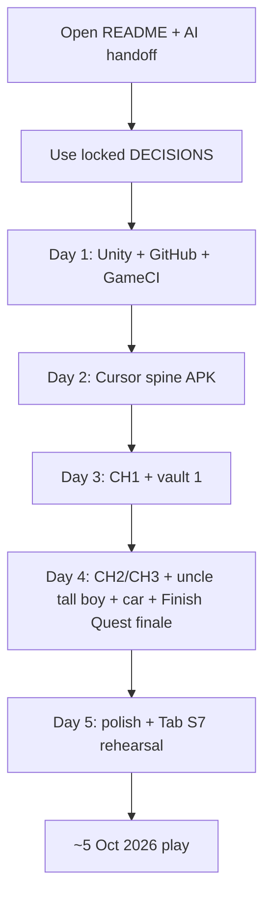

# Reliquary Lens APK — Player journey flowchart (LOCKED)

**THIS IS THE ANDROID APK VERSION (Unity on Samsung Tab S7).**  
The old browser/web game and PR #18 are frozen and are not this file.

**Locked 25 Sep 2026 — Corrected Flow Lock.** See `RELIQUARY_LENS_APK_DECISIONS.md`.

---

## Ring glossary (read first)

| Name | What it is |
|---|---|
| **Physical wedding ring** | Real wedding band — opening (on printed card) and finale rescan |
| **Printed ring card** | Flat printed card for opening handoff / scan only |
| **AR gold ring** | Digital floating ring she places once; hunt home (snowglobe / vault dials) |

Finale rescans the **physical wedding ring**, not the AR gold ring.

---

## Full player journey

```mermaid
flowchart TB
  Start[Hand printed ring card plus real wedding ring plus tablet]
  Start --> Wake[Scan ring card: gold traces real ring]
  Wake --> Fog[Fog plus blow: name Aishwarya]
  Fog --> Place[Place AR gold ring on a surface]
  Place --> Snow[Memory snowglobe from AR ring]
  Snow --> LaterMontage["Later media: Friends montage then Uncle ghost montage"]
  LaterMontage --> C1[CH1 cards 01-09]
  C1 --> V1[Vault MICROWAVECUPBOARD]
  V1 --> C2[CH2 cards 11-19]
  C2 --> V2[Vault GOLDJEWELRYPOUCH]
  V2 --> C3A[CH3 cards 21-22]
  C3A --> C23[Card 23: hunt card only; hidden behind uncle photo]
  C23 --> UncleTrig[Aim at pooja tall boy: marker on it triggers uncle walk-out]
  UncleTrig --> C3B[Cards 24-27 house]
  C3B --> Car[Card 28 passenger pocket; Card 29 car BOOT]
  Car --> V3[Vault UNDERSTAIRS]
  V3 --> OpenGift[She opens under-stairs gift]
  OpenGift --> Finish[Tap Finish Quest]
  Finish --> Letter[Magic effect plus letter: one more grand gift]
  Letter --> Rescan[Scan the real wedding ring again]
  Rescan --> Rise[Ring rises; letter: Look up]
  Rise --> Gift[Gokul is there]
```

### Numbered steps

1. Hand printed ring card + real wedding ring + tablet  
2. Scan ring card — gold light traces the real ring → AR gold ring grows  
3. Fog + blow — name **Aishwarya** (no welcome page)  
4. Place AR gold ring on a surface (drag / rotate / resize; stays pinned)  
5. Memory snowglobe rises from the AR gold ring  
6. *(Later media slots)* Friends montage → Uncle ghost montage (attach when ready; not mixed into snowglobe yet)  
7. Chapter 1 — cards **01–09**  
8. Vault 1 — **MICROWAVECUPBOARD** → Latch Click → microwave cupboard gift  
9. Chapter 2 — cards **11–19**  
10. Vault 2 — **GOLDJEWELRYPOUCH** → Velvet Pocket → gold jewelry pouch gift  
11. Chapter 3 start — cards **21–22**  
12. Card **23** — hunt card only (different image); physical hide = behind late uncle framed photo (**no** uncle walk-out here)  
13. Uncle beat — aim at **pooja tall boy**; discreet AR marker on tall boy triggers mist + ghost uncle walk-out  
14. Cards **24–27** (house)  
15. Cards **28–29** — Toyota RAV4 2024; **card 29 = car boot** (not key chain)  
16. Vault 3 — **UNDERSTAIRS** → Stairs Dust Drift → under-stairs gift  
17. She opens the under-stairs gift  
18. Tap **Finish Quest**  
19. Magical effect + letter: one more grand gift awaits — scan the ring again (the real wedding ring from the start)  
20. Scan **physical wedding ring** → ring rises → letter **Look up**  
21. **Gokul is the gift**

**Removed:** Protocol **0510** typing / entry UI. Do not build a code keypad for the finale.

---

## Build pipeline (self-serve — Thala offline; use AI handoff)

Parallel: media drops + Google AI Studio / Flow art. Friends / uncle montages attach last.

---

Rendered image: update `RELIQUARY_LENS_APK_FLOW.png` when regenerating from this mermaid (old PNG may still show Protocol 0510 — trust this `.md`).
