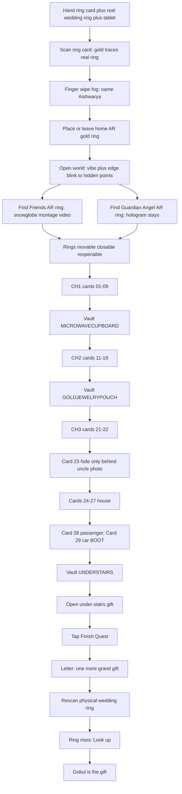

# Reliquary Lens APK — Player journey (LOCKED v2)

**Android APK · Unity · Tab S7.** Prefer this file over older flow PNGs that show Protocol 0510 or tall-boy uncle.

## Ring glossary

| Name | Meaning |
|---|---|
| **Physical wedding ring** | Real band — opening scan + finale rescan |
| **Printed ring card** | Flat card for opening handoff only |
| **Home AR gold ring** | First digital ring after wipe; vaults / home base |
| **Friends AR ring** | Found in open world → snowglobe / friends montage video |
| **Guardian Angel AR ring** | Found in open world → hologram presence (not montage) |

## Full journey

## Numbered steps

1. Hand printed ring card + real wedding ring + tablet  
2. Scan ring card — gold traces real ring  
3. Fog — **finger wipe** clears → name **Aishwarya**  
4. Home AR gold ring appears / she places or leaves it (heartbeat; stays pinned)  
5. **Open world** — walk with Lens; hidden points (she cannot see markers)  
6. Rising **vibration** + **edge blink** toward each secret  
7. Find **Friends AR ring** → snowglobe / friends **montage video**  
8. Find **Guardian Angel AR ring** → hologram wishes → **stays in room** as presence  
9. She may leave / move / close / reopen those rings anytime  
10. Chapter 1 cards **01–09**  
11. Vault **MICROWAVECUPBOARD**  
12. Chapter 2 cards **11–19**  
13. Vault **GOLDJEWELRYPOUCH**  
14. Chapter 3 cards **21–22**  
15. Card **23** — hunt hide only (behind uncle framed photo); **no** angel trigger  
16. Cards **24–27** house  
17. Cards **28–29** RAV4 — **29 = car boot**  
18. Vault **UNDERSTAIRS**  
19. Open gift → **Finish Quest**  
20. Letter → rescan **physical wedding ring** → rise → **Look up** → Gokul  

**Removed:** Protocol 0510 typing · pooja tall-boy uncle aim · “uncle ghost” name for the hologram beat.

## Build pipeline

Day 1 Unity → Day 2 spine → Day 3 CH1 → Day 4 CH2/CH3 + open-world finds + finale → Day 5 polish. See AI handoff.
